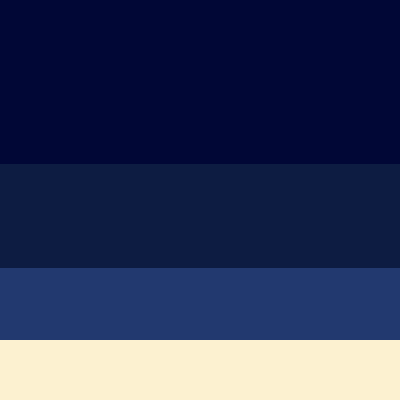

# Design: color palette

Brand reference palette for Dispatch. Earlier palette explorations and the
`color-in-use.pptx` deck are deprecated and intentionally not kept in the repo.

## Colors

| Name | Hex | RGB | HSL |
| --- | --- | --- | --- |
| Deep Navy | `#010736` | `1, 7, 54` | `233, 96%, 11%` |
| Prussian Blue | `#0d1c42` | `13, 28, 66` | `223, 67%, 15%` |
| Regal Navy | `#22396f` | `34, 57, 111` | `222, 53%, 28%` |
| Cornsilk | `#fcf1d0` | `252, 241, 208` | `45, 88%, 90%` |

CSV: `010736,0d1c42,22396f,fcf1d0`

## Suggested roles

- **Deep Navy** — page background, darkest surface.
- **Prussian Blue** — raised surfaces (cards, panels, headers).
- **Regal Navy** — borders, dividers, and interactive/accent fills.
- **Cornsilk** — primary text on any of the three navies, and light-surface background.

## Contrast

Text pairings checked against WCAG (AA needs 4.5:1 for body text).

| Foreground | Background | Ratio | Verdict |
| --- | --- | --- | --- |
| Cornsilk | Deep Navy | 17.2:1 | AAA |
| Cornsilk | Prussian Blue | 14.8:1 | AAA |
| Cornsilk | Regal Navy | 9.9:1 | AAA |
| Regal Navy | Deep Navy | 1.7:1 | surfaces only, never text |

## Formats

| File | For |
| --- | --- |
| `palette.css` | plain CSS custom properties |
| `palette.scss` | SCSS variables |
| `palette.tailwind.css` | Tailwind v4 `@theme` block with 50–950 scales |
| `palette.json` | tooling, scripts, design handoff |
| `palette.png` | visual reference |

The Tailwind scales are generated tints/shades around each base color; only the
four hexes above are the actual brand colors, exposed as the unsuffixed tokens
(`bg-deep-navy`, `text-cornsilk`, ...) next to their 50-950 scales. The client portal uses Tailwind; the dashboard and voice view use plain CSS.

## Web application

`apps/web/src/styles.css` imports `palette.css` directly and defines shared
surface, text, border and focus tokens for the shop dashboard and voice page.
Muted text is a Cornsilk tint; light notices use navy text. Booking states keep
explicit labels and distinct fills/outlines so they do not rely on color alone.

The supplied Dispatch logo lives at `apps/web/public/dispatch-logo.png` and is
used in both page headers and as the favicon. Its original artwork colors are
preserved independently of the interface palette.

## Hackathon interface treatment

The web UI extends the brand palette with a quieter midnight background
(`#080e20`), layered navy surfaces (`#101a30`), warm white text (`#f7f3e8`),
and a champagne action accent (`#ead5a3`). Shared interface tokens live in
`apps/web/src/styles.css`; client utility colors match those surfaces.

The dashboard shows a decorative orbit, animated revenue counters, and a
three-step recovery indicator driven by the actual demo state. The voice
signal animates while the assistant is speaking; it is a state indicator,
not an audio-volume meter. Row and activity transitions use Framer Motion.
CSS animations and Motion respect the system's reduced-motion preference.
The login and service discovery screens share the same visual treatment.
